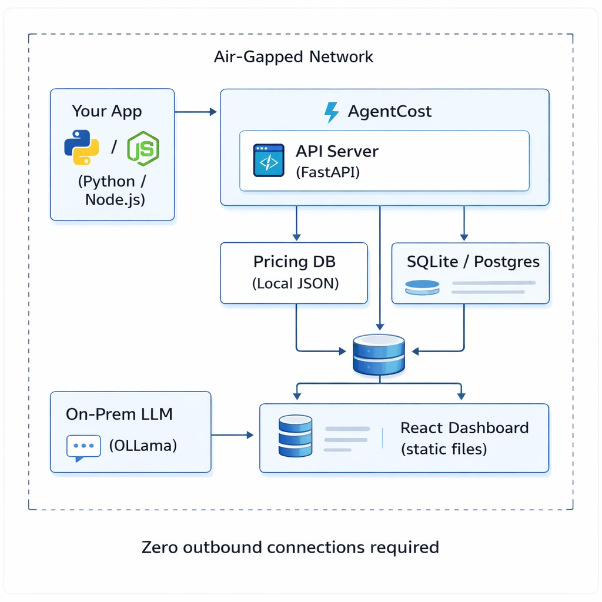

# Air-Gapped Deployment

AgentCost is fully self-contained and runs without internet access. This guide covers deploying AgentCost in air-gapped, restricted, or on-premises environments where outbound connectivity is not available.

## How It Works

AgentCost ships with everything it needs inside the Docker image:

- **Pricing database** — A vendored JSON file containing pricing for 2,610+ models from 83+ providers (OpenAI, Anthropic, Azure OpenAI, GCP Vertex AI, AWS Bedrock, Google Gemini, Mistral, Cohere, DeepSeek, and more). No external API calls are made to calculate costs.
- **Dashboard** — The React dashboard is bundled as static files. No CDN dependencies.
- **Database** — Community edition uses SQLite (single file, zero config). Enterprise supports PostgreSQL.
- **No telemetry** — AgentCost does not phone home, send analytics, or make any outbound requests.

## Deployment

### Step 1: Transfer the Docker image

On a machine with internet access, pull and save the image:

```bash
docker pull agentcost/agentcost:latest
docker save agentcost/agentcost:latest -o agentcost-image.tar
```

Transfer `agentcost-image.tar` to your air-gapped environment via USB, secure file transfer, or your approved media process.

### Step 2: Load and run

On the air-gapped machine:

```bash
docker load -i agentcost-image.tar
docker run -d \
  --name agentcost \
  --restart unless-stopped \
  -p 8100:8100 \
  -v agentcost_data:/data \
  agentcost/agentcost:latest
```

The dashboard is available at `http://<host>:8100`.

### Step 3: Instrument your code

Your application code connects to the local AgentCost instance. No external endpoints involved:

```python
from agentcost.sdk import trace
from openai import OpenAI

# Point your LLM client at your internal endpoint (Azure OpenAI, etc.)
client = trace(
    OpenAI(base_url="https://your-internal-openai.company.com/v1"),
    project="my-app",
    agentcost_url="http://agentcost-host:8100"
)
```

All cost tracking happens locally — traces are stored in the local database, costs are calculated from the local pricing file.

## Pricing Database

### Where costs come from

AgentCost vendors the pricing database from the [LiteLLM](https://github.com/BerriAI/litellm) open-source project. This is a community-maintained JSON file that covers:

| Provider                   | Coverage                                        |
| -------------------------- | ----------------------------------------------- |
| OpenAI (direct API)        | All GPT-4.1, GPT-5.x, o3, o4-mini models        |
| Anthropic (direct API)     | Claude Opus 4.6, Sonnet 4.6, Haiku 4.5          |
| Azure OpenAI               | All deployed models with Azure-specific pricing |
| GCP Vertex AI              | Gemini 3.x, PaLM, Claude on Vertex              |
| AWS Bedrock                | Claude, Titan, Llama, Mistral on Bedrock        |
| Google Gemini              | Gemini 3 Pro, Flash, and variants               |
| Mistral                    | All Mistral and Mixtral models                  |
| Cohere                     | Command, Embed models                           |
| DeepSeek                   | DeepSeek-V3, DeepSeek-R1                        |
| Open-source (Ollama, vLLM) | Tracked as $0 cost (infrastructure cost only)   |

The file is located at `agentcost/cost/model_prices.json` inside the Docker image and the Python package.

### Offline pricing updates

When model pricing changes, you can update the pricing database without internet access:

**Option A: New Docker image**

Pull the latest image on an internet-connected machine, transfer it as described in Step 1. The updated pricing database is included in every new release.

**Option B: Manual file update**

1. On an internet-connected machine, download the latest pricing file:

```bash
curl -o model_prices.json \
  https://raw.githubusercontent.com/agentcostin/agentcost/main/agentcost/cost/model_prices.json
```

2. Transfer the file to your air-gapped environment.

3. Copy it into the running container:

```bash
docker cp model_prices.json agentcost:/app/agentcost/cost/model_prices.json
docker restart agentcost
```

Pricing is effective immediately after restart.

**Option C: Custom pricing overrides**

For models with internal or negotiated pricing (e.g., your Azure OpenAI enterprise agreement), you can set custom costs via the AgentCost API:

```bash
curl -X POST http://agentcost-host:8100/api/models/pricing \
  -H "Content-Type: application/json" \
  -d '{
    "model": "azure/gpt-4.1",
    "input_cost_per_token": 0.0000018,
    "output_cost_per_token": 0.0000072
  }'
```

Custom pricing overrides take precedence over the vendored database.

## On-Premises LLM Cost Tracking

For self-hosted models (Ollama, vLLM, TGI, etc.), AgentCost tracks token usage, latency, and call volume — costs are recorded as $0.00 since there's no per-token charge. This is useful for:

- **Usage analytics** — who's using which models, how much, and how often
- **Capacity planning** — token volume trends help plan GPU scaling
- **Comparison** — see the cost delta between your self-hosted models and equivalent cloud APIs

To track infrastructure costs for on-premises LLMs (GPU hours, electricity, etc.), you can set a custom per-token cost that reflects your amortized infrastructure cost:

```bash
curl -X POST http://agentcost-host:8100/api/models/pricing \
  -H "Content-Type: application/json" \
  -d '{
    "model": "ollama/llama3.2:70b",
    "input_cost_per_token": 0.0000005,
    "output_cost_per_token": 0.0000010
  }'
```

## Enterprise Edition in Air-Gapped Environments

The enterprise edition adds governance features that are especially relevant for restricted environments:

| Feature                | Why It Matters in Air-Gapped                                                        |
| ---------------------- | ----------------------------------------------------------------------------------- |
| **SSO/SAML**           | Integrate with your internal identity provider (ADFS, Okta on-prem, Keycloak)       |
| **Policy Engine**      | Enforce which models can be used, cap costs per project                             |
| **Approval Workflows** | Require human approval for expensive model usage                                    |
| **Audit Logs**         | Hash-chained compliance trail for regulatory requirements                           |
| **Budget Enforcement** | Auto-downgrade models when budgets are hit — critical when chargebacks are involved |
| **Anomaly Detection**  | Catch runaway agents without relying on external monitoring                         |

Enterprise licensing works offline — the license key is validated locally using HMAC-SHA256 signatures. No license server or internet access required.

## Architecture Summary



## FAQ

**Does AgentCost make any outbound network calls?**
No. All cost calculations use the local pricing database. No telemetry, no analytics, no license server calls.

**How often does the pricing database need updating?**
Major pricing changes happen a few times per year. For most deployments, updating quarterly is sufficient. If you need exact-to-the-penny accuracy for billing, update monthly.

**Can I run AgentCost on Kubernetes?**
Yes. The Docker image works in any container runtime — Docker, Kubernetes, OpenShift, ECS. Use a PersistentVolume for the `/data` directory to retain the SQLite database across pod restarts.

**What about PostgreSQL in air-gapped?**
Enterprise edition supports PostgreSQL. Deploy PostgreSQL within your air-gapped network and set the `DATABASE_URL` environment variable. The Docker Compose file includes a PostgreSQL configuration.

---

**Questions about air-gapped deployment?** Contact us at [care@agentcost.in](mailto:care@agentcost.in) or open an issue on [GitHub](https://github.com/agentcostin/agentcost/issues).
